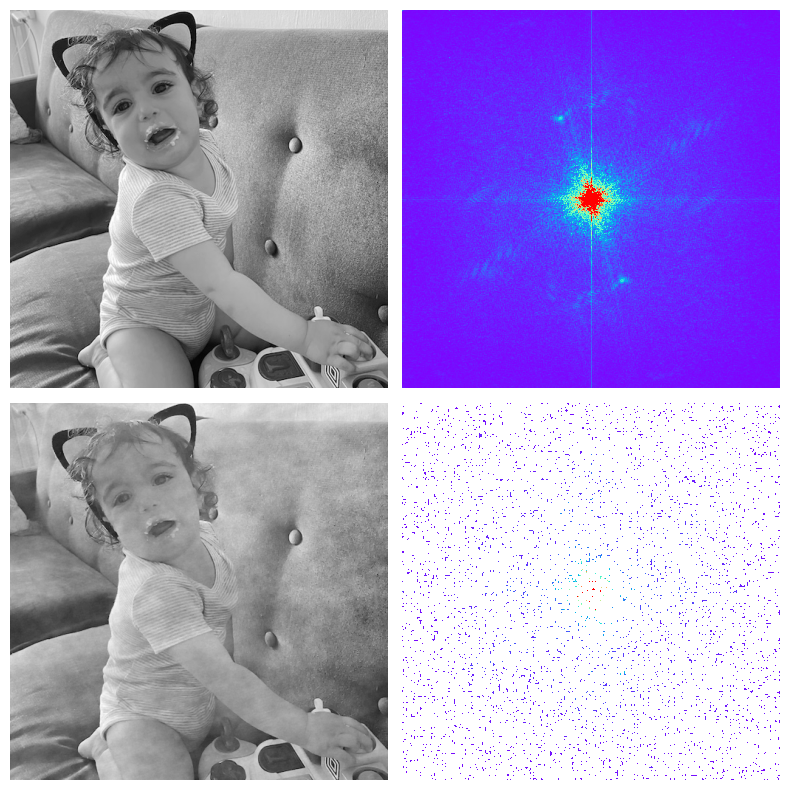

# Split Bregman Method - Experiments

[The split Bregman method for L1-regularized problems](https://ww3.math.ucla.edu/camreport/cam08-29.pdf)

### Split Bregman
Bregman Iteration can be used to solve a wide variety of constrained optimization problems.
Using this technique, the “Split Bregman” (SB) method developed, which can solve a very broad class of l1-regularized problems.

### Experimets
Reproducing the results of the paper using the Split Bregman method for TV denoising and Compressed Sensing reconstruction.

## Results
### TV denoising


### CS reconstruction


### dependencies
Python 3.11
```
pylops
numpy
matplotlib
skimage
```

### References
```
@article{goldstein2009split,
  title={The split Bregman method for L1-regularized problems},
  author={Goldstein, Tom and Osher, Stanley},
  journal={SIAM journal on imaging sciences},
  volume={2},
  number={2},
  pages={323--343},
  year={2009},
  publisher={SIAM}
}
